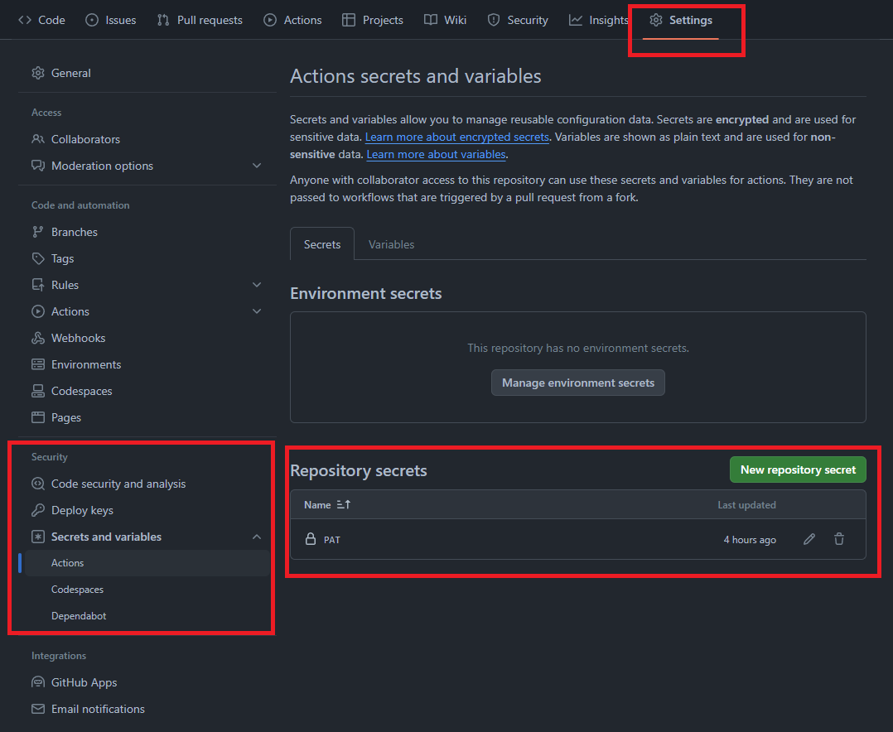

# GitHub Actions 練習

## 需求描述

於DEV分支開發, 開發完成PR回MASTER時觸發流程, 

產生Release資訊並將CODE與說明文件壓縮成ZIP檔案發布

## 練習項目

- 完成階段開發後, 依據設定觸發事件, 自動產生Release Note與壓縮檔

- 進階: 可以拿原始檔markdown或其他玩意, 產生網頁release與下載用的PDF

## 結果

### 範例模板

1. 在 `.github/workflow/` 建立YAML檔案描述工作流程

2. YAML檔案流程雷點: 個人TOKEN設定

  - 在自己帳號下先產生TOKEN (GitHub叫PAT, Personal Access Toekn), 壞掉時再查, 可能會改機制

  - 在專案資料夾下新增對應KEY名稱, 之後在YAML就可以使用

  

3. YAML使用對應KEY: `GITHUB_TOKEN: ${{ secrets.PAT }}`

4. 使用指定MD檔案作為Release Content: 使用`body_path`指定來源檔案

5. 產生Asset時排除檔案: .gitattributes

### 討論項目

1. 需求應修正為: 賦予版號(TAG)時觸發, 並依據版號產生Release資訊

2. 情境為交付原始碼, 僅需要提供Code檔案與說明文件, 故使用內建Asset並配合.gitattributes即可產生所需ZIP檔案

3. 需求功能與語法找尋

  - 本次練習花費最多時間就在語法測試, 需丟上去觸發WORKFLOW後才能看到執行過程, 若較為複雜的流程可能要對應測試環境

  - 語法最快還是看官方文件, 執行系統不同與改版差異, 輔助資訊不見得準確(ex. ChatGPT, Google)

4. Marketplace

  - 若遇到的情境需要將MD文件轉換成PDF或HTML來交付, 如何找到適用的模組與測試又是另一個問題
